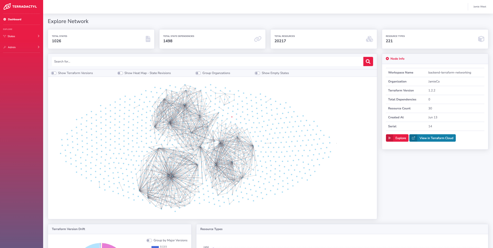
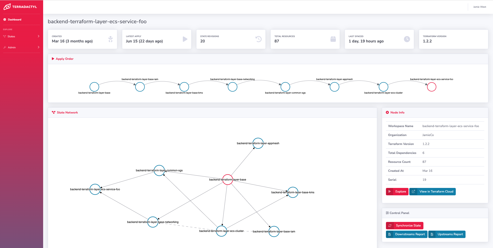

 
</img>
 
<h1>Terradactyl</h1>

Terradactyl provides a bird's eye view of your Terraform states by analysing your remote state files and parsing them into a Tinkerpop graph database. With this you can explore your state network, viewing individuals or identifiying dependencies. If you want to run a state, Terradactyl will even provide a path of dependencies to run first, based on their own, in order to get to where you want to be.

Initially this project was just a bit of fun to help identify the run order for states. It quickly became apparent though, that you can build out some really interesting visualizations and generate useful information about your Terraform real estate using the Terraform Cloud APIs and some state parsing.

:warning: Terradactyl currently only supports *Terraform Cloud* as we rely heavily on their APIs to retrieve state revision history.

## Current Features
* Identifying state run orders (the order in which you must run all states, start to finish to get to the one you want. E.g. in a DR scenario or setting up a redundant environment).
* Visualizing State interactions/dependencies at the Terraform Cloud Organizational level. At a glance identify larger states, _Terraform version drift_.
* Exploration of individual states: viewing the local dependency networks, resource counts, growth over time.
* Identify redundant dependencies between states. This works by parsing state files (no actual resource data is stored other than some metadata like names, counts) and checking which data.terraform_remote_state namespaces are not used. *This relies solely on the use of `terraform_remote_state` blocks. If you don't use these (against best practice) this functionality won't be accurate.

## Screenshots
Below show the two main screens - viewing your overall and individual state networks.

## Local Development
### Putting it together
#### Install Requirements
1. Set up a Virtual Environemnt: `virtualenv -p python3 venv`
2. Install python dependencies: `pip install -r requirements.txt`
3. Install Docker - https://docs.docker.com/get-docker/
#### Running the Dev Environment
1. Start redis - `brew services start redis`
2. Confirm redis working (will reply PONG): `redis-cli ping`
3. Start the TinkerPOP Gremlin server - `docker run -p 8182:8182 -d --name terradactyl-gremlin tinkerpop/gremlin-server:3.4.10`
3. Start the Django sync web worker: `cd terradactyl && python manage.py runserver`
4. Start the async worker: `cd terradactyl && celery -A terradactyl worker -l INFO`
